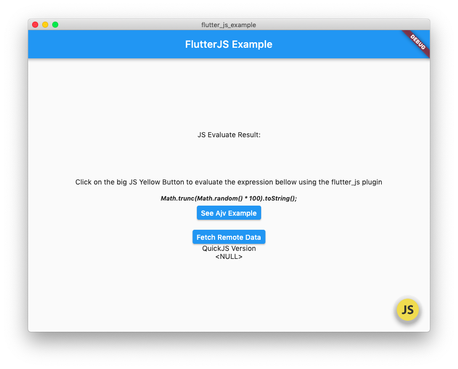

# Flutter JS plugin

A Javascript engine to use with flutter. Now it is using QuickJS on Android   through Dart ffi and JavascriptCore on IOS also through dart-ffi. The Javascript runtimes runs synchronously through the dart ffi. So now you can run javascript code as a native citzen inside yours Flutter ~~Mobile~~ Apps (Android, IOS, Windows, Linux and MacOS are all supported).

In the previous versions we only get the result of evaluated expressions as String. 

**BUT NOW** we can do more with  flutter_js, like run **xhr** and **fetch** http calls through Dart http library. We are supporting **Promises** as well.

With flutter_js Flutter applications can take advantage of great javascript libraries such as ajv (json schema validation), moment (DateTime parser and operations) running natively (no PlatformChannels needed) on mobile devices, both Android and iOS.

On IOS this library relies on the native JavascriptCore provided by iOS SDK. In Android it uses the amazing and small Javascript Engine QuickJS [https://bellard.org/quickjs/](https://bellard.org/quickjs/) (A spetacular work of the Fabrice Bellard and Charlie Gordon).

To debug JS code on iOS you need to set `javascriptRuntime.setInspectable(true);` and pass sourceUrl to `evaluate` (example: sourceUrl: 'script.js').

On Android you could use JavascriptCore as well You just need add an Android dependency `implementation "com.github.fast-development.android-js-runtimes:fastdev-jsruntimes-jsc:0.3.4"` and pass `forceJavascriptCoreOnAndroid: true` to the function `getJavascriptRuntime`. 


On MacOS the JavascriptCore, provided by the OSX is used. In Windows and Linux the engine used is the QuickJS. In the 0.4.0 version we borrowed the dart ffi source code from the flutter_qjs lib. `flutter_qjs` is a amazing package and they made a excelent work in build a good ffi bridge between Dart and JS, also doing the quickjs source code changes to allow it to run on WIndows. But, flutter_js take the approach to use JavascriptCore on IOS (mainly) to avoid refusals on the Apple Store, which state that `Apps may contain or run code that is not embedded in the binary (e.g. HTML5-based games, bots, etc.), as long as code distribution isn’t the main purpose of the app`. It also says `your app must use WebKit and JavaScript Core to run third-party software and should not attempt to extend or expose native platform APIs to third-party software;` Reference: https://developer.apple.com/app-store/review/guidelines/ [ Session  4.7]. So, we avoid to use quickjs in IOS apps, so flutter_js provides an abstraction called JavascriptRuntime which runs using JavascriptCore on Apple devices and Desktop and QuickJS in Android, Windows and Linux.

FLutterJS allows to use Javascript to execute validations logic of TextFormField, also we can execute rule engines or redux logic shared from our web applications. The opportunities are huge.


The project is open source under MIT license. 

The bindings for use to communicate with JavascriptCore through dart:ffi we borrowed it from the package [flutter_jscore](https://pub.dev/packages/flutter_jscore).

Flutter JS provided the implementation to the QuickJS dart ffi bindings and also constructed a wrapper API to Dart which provides a unified API to evaluate javascript and communicate between Dart and Javascript through QuickJS and Javascript Core in a unified way. 

This library also allows to call xhr and fetch on Javascript through Dart Http calls. We also provide the implementation which allows to evaluate promises.


Flutter JS on Mobile


Flutter JS on Desktop


## Features:

## Instalation

```yaml
dependencies:
  flutter_js: 0.1.0+0
```

### iOS

Since flutter_js uses the native JavascriptCore, no action is needed.

### Android

Change the minimum Android sdk version to 21 (or higher) in your `android/app/build.gradle` file.

```
minSdkVersion 21
```

## Release Deploy

### Android

Setup of proguard to release builds: setup your android/app/proguard-rules.pro file 
with the content bellow.

> Remember to merge with another configurations needed for 
others plugins your app uses.

```proguard-rules.pro
#Flutter Wrapper
-keep class io.flutter.app.** { *; }
-keep class io.flutter.plugin.**  { *; }
-keep class io.flutter.util.**  { *; }
-keep class io.flutter.view.**  { *; }
-keep class io.flutter.**  { *; }
-keep class io.flutter.plugins.**  { *; }
-keep class de.prosiebensat1digital.** { *; }
``` 

Also add these lines to your `android -> buildTypes -> release` section of android/app/build.gradle file:

```gradle
 minifyEnabled true
  useProguard true

  proguardFiles getDefaultProguardFile('proguard-android.txt'), 'proguard-rules.pro'
```
 

## Examples

Here is a small flutter app showing how to evaluate javascript code inside a flutter app


```dart
import 'package:flutter/material.dart';
import 'dart:async';

import 'package:flutter/services.dart';
import 'package:flutter_js/flutter_js.dart';

void main() => runApp(MyApp());

class MyApp extends StatefulWidget {
  @override
  _MyAppState createState() => _MyAppState();
}

class _MyAppState extends State<MyApp> {
  String _jsResult = '';
  JavascriptRuntime flutterJs;
  @override
  void initState() {
    super.initState();
    
    flutterJs = getJavascriptRuntime();
  }

  @override
  Widget build(BuildContext context) {
    return MaterialApp(
      home: Scaffold(
        appBar: AppBar(
          title: const Text('FlutterJS Example'),
        ),
        body: Center(
          child: Column(
            mainAxisAlignment: MainAxisAlignment.center,
            children: <Widget>[
              Text('JS Evaluate Result: $_jsResult\n'),
              SizedBox(height: 20,),
              Padding(padding: EdgeInsets.all(10), child: Text('Click on the big JS Yellow Button to evaluate the expression bellow using the flutter_js plugin'),),
              Padding(
                padding: const EdgeInsets.all(8.0),
                child: Text("Math.trunc(Math.random() * 100).toString();", style: TextStyle(fontSize: 12, fontStyle: FontStyle.italic, fontWeight: FontWeight.bold),),
              )
            ],
          ),
        ),
        floatingActionButton: FloatingActionButton(
          backgroundColor: Colors.transparent, 
          child: Image.asset('assets/js.ico'),
          onPressed: () async {
            try {
              JsEvalResult jsResult = flutterJs.evaluate(
                  "Math.trunc(Math.random() * 100).toString();");
              setState(() {
                _jsResult = jsResult.stringResult;
              });
            } on PlatformException catch (e) {
              print('ERRO: ${e.details}');
            }
          },
        ),
      ),
    );
  }
}

```


**How to call dart from Javascript**

You can add a channel on `JavascriptRuntime` objects to receive calls from the Javascript engine:

In the dart side:

```dart
javascriptRuntime.onMessage('someChannelName', (dynamic args) {
     print(args);
});
```


Now, if your javascript code calls `sendMessage('someChannelName', JSON.stringify([1,2,3]);` the above dart function provided as the second argument will be called
with a List containing 1, 2, 3 as it elements.


## Alternatives (and also why we think our library is better)

There were another packages which provides alternatives to evaluate javascript in flutter projects:

### https://pub.dev/packages/flutter_liquidcore

Good, is based on https://github.com/LiquidPlayer/LiquidCore

It is based on V8 engine so the exectuable library is huge (20Mb). So the final app will be huge too.


### https://pub.dev/packages/interactive_webview

Allows to evaluate javascript in a hidden webview. Does not add weight to size of the app, but a webview means a entire browser is in memory just to evaluate javascript code. So we think an embeddable engine is a way better solution.

### https://pub.dev/packages/jsengine

Based on jerryscript which is slower than quickjs. The jsengine package does not have implementation to iOS.

### https://pub.dev/packages/flutter_jscore

Uses Javascript Core in Android and IOS. We got the JavascriptCore bindings from this amazing package. But, by
default we provides QuickJS as the javascript runtime on Android because it provides a smaller footprint. Also 
our library adds support to ConsoleLog, SetTimeout, Xhr, Fetch and Promises to be used in the scripts evaluation 
and allows your Flutter app to provide dartFunctions as channels through `onMessage` function to be called inside
your javascript code.


### https://pub.dev/packages/flutter_qjs

Amazing package which does implement the javascript engine using quickjs through Dart ffi.
The only difference is it uses quickjs also on IOS devices, which we understand would be problematic to pass Apple Store Review process. In the flutter_js 0.4.0 version, which we
added support to Desktop and also improved the Dart/Js integration, we borrowed the C function bindings and Dart/JS conversions and integrations from the flutter_qjs source code. We just adapted it to support xhr, fetch and to keep the same interface provided on flutter_js through the class JavascriptRuntime.


## Small Apk size

A hello world flutter app, according flutter docs has 4.2 Mb or 4.6 Mb in size.

https://flutter.dev/docs/perf/app-size#android


Bellow you can see the apk sizes of the `example app` generated with *flutter_js*:

```bash

|master ✓| → flutter build apk --split-per-abi

✓ Built build/app/outputs/apk/release/app-armeabi-v7a-release.apk (5.4MB).
✓ Built build/app/outputs/apk/release/app-arm64-v8a-release.apk (5.9MB).
✓ Built build/app/outputs/apk/release/app-x86_64-release.apk (6.1MB).
```


## Ajv

We just added an example of use of the amazing js library [Ajv](https://ajv.js.org/) which allow to bring state of the art json schema validation features
to the Flutter world. We can see the Ajv examples here: https://github.com/abner/flutter_js/blob/master/example/lib/ajv_example.dart 


See bellow the screens we added to the example app:

### IOS


### Android


## MACOS

* To solve `Command Line Tool - Error - xcrun: error: unable to find utility “xcodebuild”, not a developer tool or in PATH`

> sudo xcode-select -s /Applications/Xcode.app/Contents/Developer

In Catalina with XCode 12 i needed to install ruby 2.7.2 in order to install `cocoapods` (Also needed to Flutter on IOS). So i installed `brew`and after `rbenv`.

To enable http calls, add this to your files: 

* DebugProfile.entitlements
```plist
<?xml version="1.0" encoding="UTF-8"?>
<!DOCTYPE plist PUBLIC "-//Apple//DTD PLIST 1.0//EN" "http://www.apple.com/DTDs/PropertyList-1.0.dtd">
<plist version="1.0">
<dict>
	<key>com.apple.security.app-sandbox</key>
	<true/>
	<key>com.apple.security.cs.allow-jit</key>
	<true/>
	<key>com.apple.security.network.client</key>
	<true/>
	<key>com.apple.security.network.server</key>
	<true/>
</dict>
</plist>

```

* Release.entitlements
```plist
<?xml version="1.0" encoding="UTF-8"?>
<!DOCTYPE plist PUBLIC "-//Apple//DTD PLIST 1.0//EN" "http://www.apple.com/DTDs/PropertyList-1.0.dtd">
<plist version="1.0">
<dict>
	<key>com.apple.security.app-sandbox</key>
	<true/>
	<key>com.apple.security.network.client</key>
	<true/>
	<key>com.apple.security.network.server</key>
	<true/>
</dict>
</plist>
```


## Windows and Linux

The C wrapper library is hosted on this github repository: https://github.com/abner/quickjs-c-bridge 

We just separated the code to allow build it and in this repository we have only the released shared library, so each application using the flutter_js does not need to keep recompiling it all the time

## QuickJs Android shared libraries

The library wrapper, both QuickJS and JavascriptCore, are also compiled in a separated repository: https://github.com/fast-development/android-js-runtimes

With the library being compiled and published to jitpack, applications using the wrappers, through flutter_js does not need to compile the shared library using Android NDK.


## Unit Testing javascript evaluation

We can unit test evaluation of expressions on flutter_js using the desktop platforms (windows, linux and macos).

For `Windows` and `Linux` you need to build your app Desktop executable first: `flutter build -d windows` or `flutter build -d linux`.

On Windows, after build your application for the first time, at least, add the path `build\windows\runner\Debug` (the absolute path) to your environment path.

In powershell, just run `$env:path += ";${pwd}\build\windows\runner\Debug"`. Now you can run the test in the command line session where you added the `\build\windows\runner\Debug` into the path.

For `Linux` you need to exports an environment variable called `LIBQUICKJSC_TEST_PATH` pointing to `build/linux/debug/bundle/lib/libquickjs_c_bridge_plugin.so`. eg: `export LIBQUICKJSC_TEST_PATH="$PWD/build/linux/debug/bundle/lib/libquickjs_c_bridge_plugin.so"`


To run the test integrated Visual Studio Code, you will need to setup a launcher to the `.vscode/launch.json` file,
so you can fill-in the build folder into the `PATH` on Windows and the `LIBQUICKJSC_TEST_PATH` for linux:

```json
{
    "version": "0.2.0",
    "configurations": [
        {
            "name": "test-with-flutterjs",
            "type": "dart",
            "program": "test/flutter_js_test.dart",
            "windows": {
                "env": {
                    "PATH": "${env:Path};${workspaceFolder}\\example\\build\\windows\\runner\\Debug"
                }
            },
            "linux": {
                "env": {
                    "LIBQUICKJSC_TEST_PATH": "${workspaceFolder}/example/build/linux/debug/bundle/lib/libquickjs_c_bridge_plugin.so"
                }
            },
            "request": "launch"
        }
    ]
}
```

> For running unit tests on MacOSx no extra steps are needed.
